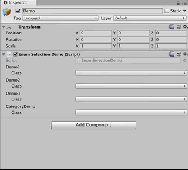

# EnumSelection

EnumSelection can show popup which can select enum class & value.

If you like, please press  :star: :star: :star: :smile:

## Demo



## Download

FIXME

## Usage

Define enum with EnumSelectionEnable attribute.

```csharp
[EnumSelectionEnable]
public enum Sample {
  Value1,
  Value2,
}
```

Refer EnumSelection class on your MonoBehaviour.

```csharp
public class Demo : MonoBehaviour {
    public EnumSelection Value;
}
```

That's it! Now you can select any enums with EnumSelectionEnable attribute.

### Parse

There are some methods to parse enum Value.

```csharp
// EnumSelection Value;
var value1 = this.Value.GetEnum<Sample>();
var value2 = this.Value.GetEnum(typeof(Sample));
var value3 = this.Value.GetEnum(); // automatically parse enum by stored class name & assembly name
```

### Class Check

Check stored class is expecting enum.

```csharp
bool isSampleEnum1 = this.Value.IsEnumClass<Sample>();
bool isSampleEnum2 = this.Value.IsEnumClass(typeof(Sample));
```

### Categroy

Category restricts enum class on popup menu.

```csharp
[EnumSelectionEnable(Category = "MyCategory")]
public enum Sample {
    Value1,
    Value2,
}
```

```csharp
public class Demo : MonoBehaviour {
    [EnumSelectionOption(Category = "MyCategory")]
    public EnumSelection Value;
}
```

## License

- [MIT](./LICENSE.md)
