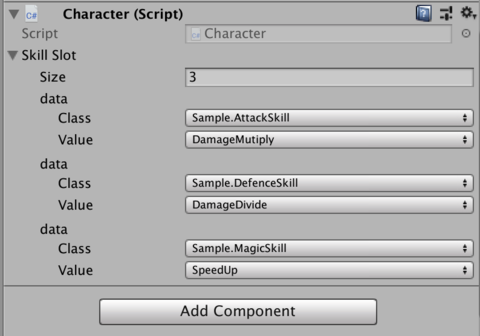

# EnumSelection

EnumSelection shows popups which can select enum class & value.

If you like, please press  :star: :star: :star:

## Why?

Unity's default enum popup is easy to use by just declaring simple enum field.

```csharp
public class SampleBehaviour : MonoBehaviour {
    public SampleEnum Value;
}

public enum SampleEnum {}
```

But there are some cases which require to handle multiple enum class at one field.
For example, implementing skill slots that each of skills is defined by enum.

```csharp
[EnumSelectionEnable(Category = "Skill")]
public enum AttackSkill
{
    DamageAdd,
    DamageMutiply,
    // ...
}

[EnumSelectionEnable(Category = "Skill")]
public enum DefenceSkill
{
    DamageSubtract,
    // ...
}
```

EnumSelection handles multiple skill enums at one field.

```csharp
public class Accessory : MonoBehaviour
{
    [EnumSelectionOption(Category = "Skill")]
    public EnumSelection[] Slot = new EnumSelection[3];

    private void Start()
    {
        foreach(var skill in this.Slot)
        {
            if (skill.IsEnumClass<AttackSkill>())
            {
                var value = skill.GetEnum<AttackSkill>();
                // apply attack skill
            }
            // ...
        }
    }
}
```

It's very easy to handle multiple enum types and select enum type & value with popups.



## Demo


## Download

Download from [latest release page](https://github.com/mattak/EnumSelection/releases).

## Usage

Define enum with EnumSelectionEnable attribute.

```csharp
[EnumSelectionEnable]
public enum Sample {
    Value1,
    Value2,
}
```

Refer EnumSelection class on your MonoBehaviour.

```csharp
public class Demo : MonoBehaviour {
    public EnumSelection Value;
}
```

That's it!

Now you can select any enums with EnumSelectionEnable attribute.

### Parse

There are some methods to parse enum Value.

```csharp
// EnumSelection Value;
var value1 = this.Value.GetEnum<Sample>();
var value2 = this.Value.GetEnum(typeof(Sample));
var value3 = this.Value.GetEnum(); // automatically parse enum by stored class name & assembly name
```

### Class Check

Check stored class is expecting enum.

```csharp
bool isSampleEnum1 = this.Value.IsEnumClass<Sample>();
bool isSampleEnum2 = this.Value.IsEnumClass(typeof(Sample));
```

### Categroy

Category restricts enum class on popup menu.

```csharp
[EnumSelectionEnable(Category = "MyCategory")]
public enum Sample {
    Value1,
    Value2,
}
```

```csharp
public class Demo : MonoBehaviour {
    [EnumSelectionOption(Category = "MyCategory")]
    public EnumSelection Value;
}
```


## License

- [MIT](./LICENSE.md)
